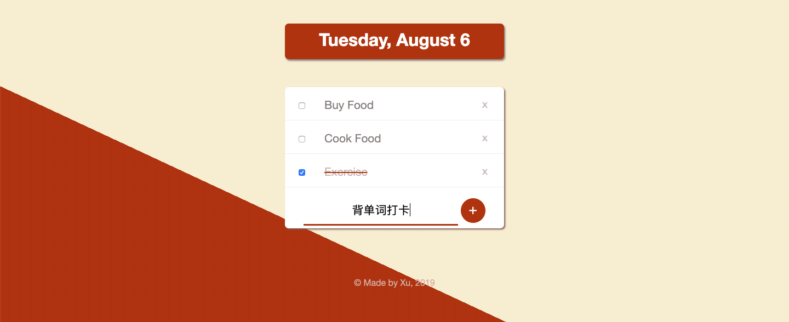

# Todo-List
Two versions of Todo-List application.

:point_right: [Click me to see the example!](https://sincerity628.github.io/Todo-List/) :point_left:
（js版）

- [两个不同版本](#main-function)
    - [ejs](#ejs)
        - [效果展示](#effect-ejs)
        - [实现过程](#steps-ejs)
    - [纯js](#js)
        - [效果展示](#effect-js)
        - [实现过程](#steps-js)
- [应用方向](#apply)

---
<h4 id="core-step">两个不同版本</h4>
<h5 id="ejs">ejs</h5>
&#8195;&#8195;第一个版本的Todo-List用了一种模版型语言 
ejs (https://ejs.co) ，加上它可以使用简单的js生成html，就减轻了一些重复性的html书写工作（用for循环和列表实现）；此外，与最初的JavaScript相比较，通过使用ejs模版，可以更容易地让代码更加干净整洁，让人易懂。通过官方教程和网上搜集相关资料可以很容易的使用这个工具。


<h6 id="effect-ejs">效果展示</h6>

1. 界面

应用的主界面如下：


2. 功能

添加待做事项


标记已完成事项


3. 不足

* 若是在此基础上继续添加新的待做事项，原本的标记将会自动清空

* 没有事件删除功能

<h6 id="steps-ejs">实现过程</h6>

1. 基本后端app.js文件搭建

在应用所在文件夹中建立app.js文件，写好一些常规的代码，用命令行将基本的环境配置好。

app.js : 

```js

//jshint esversion: 6

const express = require("express");
const bodyParser = require("body-parser");

const app = express();
app.use(bodyParser.urlencoded({extended: true}));

let day = getDate();
function getDate() {
    let today = new Date();
    let options = {weekday: "long", day: "numeric", month: "long"};
    return today.toLocaleDateString("en-US", options);
};

app.get("/", function(req, res) {
    res.sendFile(__dirname + {{fileRoute}});
});
app.listen(3000, function(req, res) {
    console.log("The server is on port 3000.");
});

```

2. 根据功能编写大致界面

将一个Todo-List所需要的元素（标题，checkbox，事项名称，输入框，按钮，脚注等）先列在网页中，待功能完善后，再去调整样式

```html
<!DOCTYPE html>
<html lang="en">
<head>
    <meta charset="UTF-8">
    <meta name="viewport" content="width=<device-width>, initial-scale=1.0">
    <meta http-equiv="X-UA-Compatible" content="ie=edge">
    <title>Document</title>
    <link rel="stylesheet" href="css/styles.css">
</head>
<body>
    <div class="title-box">
        <h1 class="title">Date</h1>
    </div>
    <div class="ul-box">
        <div class="item-box">
            <input type="checkbox">
            <p class="item-text">Buy Book</p>
        </div>
    </div>
    <div class="form-box">
        <form class="form" action="/" method="POST">
            <input type="text" name="newItem" placeholder="Add a new item here..." autocomplete="off">
            <button type="submit" name="list" value="btn"></button>+</button>
        </form>
    </div>
    <footer>© Made by Xu, 2019</footer>
</body>
</html>
```

3. 参考文档并实现相关功能

初步想法为：先使用一个列表存储待做事项，用户通过在页面点击按钮提交表单，后台获取到输入框内容，添加至待做事项列表中，然后通过循环的方式让其显示在主页面，而已完成事项的标记通过样式间关系编写css进行实现。
   * 首先建立存储事件的列表
    
```js
let items = ["Buy Books", "Read Books", "Exercise"];

```

   * 获取输入框内容并将其添加至列表尾部
    
```js
app.post("/", function(req, res) {
    // console.log(req.body);
    let item = req.body.newItem;// 名字需与html文件中一致
    if(item != "") {// 判断用户输入信息是否为空
        items.push(item);
    }   
    res.redirect("/");// 回到主界面
});
```

   *  查看通过Express使用ejs的方法文档（https://github.com/mde/ejs/wiki/Using-EJS-with-Express）
    做相关配置
    
   * 新建一个views文件夹，在其中新建一个index.ejs文件，将之前变编写的html代码粘贴到其中并保存。

```js
app.set('view engine', 'ejs');
app.get("/", function(req, res) {
    res.render("index", {listTitle: day, list: items});
});

```
&#8195;&#8195;进入主页将会看到index.ejs内的内容，并且在js中将定义好的day与items作为参数传递到ejs文件中，它们在ejs文件中新的名字分别listTitle与list。

* 编写for循环显示列表内容
    
```
for(let i = 0; i < list.length; i++) {
    <div class="item-box">
        <input type="checkbox">
        <p class="item-text">items[i]</p>
    </div>
}
```


 * 根据文档，将其中非html内容，即属于js范畴的内容用“<% %>”括起来，将使用从js文件中传递过来的参数用“<%= %>”括起来。
     
```
<div class="title-box">
    <h1 class="title"><%= listTitle %></h1>
</div>
<% for(let i = 0; i < list.length; i++) { %>
    <div class="item-box">
        <input type="checkbox">
        <p class="item-text"><%= list[i] %></p>
    </div>
<% } %>
``` 

* 最后，在编写好其他界面样式后，在此基础上添加已完成事项的样式编写

```css
input:checked+p {
    text-decoration: line-through;
    text-decoration-color: #A683E3;
}
``` 

当checkbox被打上勾时，将紧接着它的所有p元素加上字符中间划线的效果，从而达到目的。

<h5 id="js">纯js</h5>

&#8195;&#8195;为了弥补之前用ejs实现的一些缺陷，并且想要做出一个功能更加完整的Todo-List,现在使用纯html，css，以及js进行项目应用的改进。

<h6 id="effect-js">效果展示</h6>

1. 界面

应用的主界面如下：


2. 功能

添加待做事项




（此时可以看出，即使添加了新的事项也不会影响之前的标记情况）

删除不想要的事项


3. 不足

* 点击页面刷新后，一夜回到解放前，啥也没了，可以通过使用本地存储解决此问题
学习链接（https://codepen.io/csdev/pen/NNEzPN） 


<h6 id="steps-js">实现过程</h6>
思路很简单，就是通过dom在一定条件下控制html页面中的元素从而达到添加元素、删除元素的目的，添加已完成标记的方式与ejs版本一致。

```js
window.onload = function() {
    getTime();
    $(".close").click(deleteItem);
    // 检查是否点击删除标志
}

function newItem() {
    // alert("wow, you clicked on me!");
    let input = document.getElementsByClassName("form-input")[0].value;
    if(input === '') {// 判断用户输入是否为空
        alert("At least write something...");
        return;
    }

    let newDiv = document.createElement("div");
    newDiv.className = "item-box";

    let newCheckBox = document.createElement("input");
    newCheckBox.type = "checkbox";

    let newInput = document.createTextNode(input);
    let newP = document.createElement("p");
    newP.appendChild(newInput);
    newP.className = "item-text";

    let newClose = document.createElement("span");
    newClose.appendChild(document.createTextNode("x"));
    newClose.className = "close";

    newDiv.appendChild(newCheckBox);
    newDiv.appendChild(newP);
    newDiv.appendChild(newClose);
    // 按照
    // - div
    //   -checkbox
    //   -p
    //   -span
    // 的格式创建新的一个事项，并添加其对应的class

    let container = document.getElementsByClassName("ul-box")[0];
    container.appendChild(newDiv);
    // 加入ul-box中

    document.getElementsByClassName("form-input")[0].value = '';
    // set input box to null
    $(".close").click(deleteItem);
    // 监听删除操作
}

function deleteItem() {
    $(this).parent().remove();
    // 将用户所点击删除符号所在的div一起删除，即删除整个事项
} 

```
